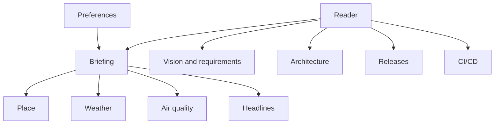
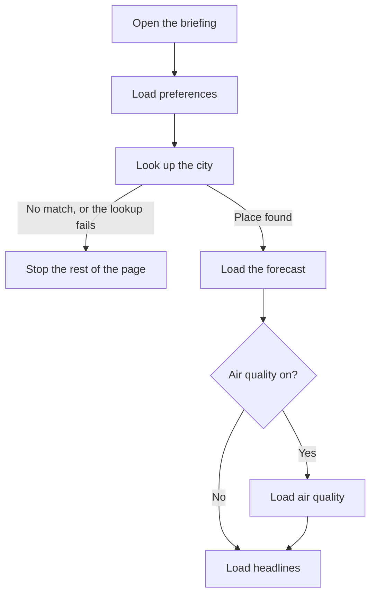
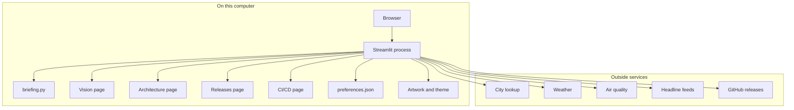

# Daily briefing: architecture

## Conceptual

The reader has a briefing, two explanations of it, a releases page, and a CI/CD page. The explanations are the vision and requirements, and this architecture. Four ideas sit behind the briefing: a place, the weather there, the air there, and a short list of headlines. Preferences remember how the reader wants that page set up. The architecture page in the app draws the diagrams in this document.

## Logical

`app.py` registers `briefing.py`, `pages/1_Vision_and_requirements.py`, `pages/2_Architecture.py`, `pages/3_Releases.py`, and `pages/4_CI_CD.py`, then runs the one the reader opened from the sidebar. The sidebar also reads and writes preferences. The briefing's main column asks for a place, then weather, then air quality when it is enabled, then headlines. Each outside call can fail on its own. A failed city lookup stops the rest of the page. A failed forecast, air-quality call, or feed does not hide the other sections. If a feed answers 403, the app reads that same feed through `api.rss2json.com`. The releases page shows the latest GitHub release and its notes, and the reader can open an older release from the same list.

| Concern | What it does | How long a result is reused |
| --- | --- | --- |
| Preferences | Load and save city, units, air-quality toggle, and feeds | Until the reader changes them |
| Place | Turn a city name into a location | 30 minutes |
| Weather | Current conditions and five daily rows | 15 minutes |
| Air quality | US AQI, PM2.5, and PM10 | 15 minutes |
| Headlines | Up to five items per selected feed | 15 minutes |
| Releases | Latest version and its notes, with older releases available | 15 minutes |

Saved feeds that are no longer in the catalog are dropped. An unrecognized unit falls back to Fahrenheit. A missing, unreadable, or wrongly shaped preferences file falls back to New York, Fahrenheit, air quality on, and BBC News plus NPR News. A file that is JSON but not an object, or a setting that is not the expected type, is treated the same way for that setting.

## Physical

The app is one Python process, started with `streamlit run app.py` from a local virtual environment (`.venv`). The page is served at `http://localhost:8501`.

| Piece | Where it lives |
| --- | --- |
| Entrypoint | `app.py` registers the five pages and runs the one chosen in the sidebar |
| Briefing | `briefing.py` |
| Vision summary | `pages/1_Vision_and_requirements.py` |
| Architecture summary | `pages/2_Architecture.py` |
| Releases page | `pages/3_Releases.py` |
| CI/CD page | `pages/4_CI_CD.py` explains `.github/workflows/release.yml`, which runs on each push to `main` |
| Artwork | `assets/city-weather-background.jpg` behind the page, `assets/city-weather-icon.jpg` as the browser icon, `assets/city-weather-logo.jpg` in the sidebar |
| Theme | `.streamlit/config.toml` sets the light widget palette |
| Dependencies | `requirements.txt`, installed into `.venv` |
| Preferences | `preferences.json` beside `app.py`, unless `DAILY_BRIEFING_PREFS` points somewhere else |
| Tests | `tests/`, run with `.venv/bin/python -m pytest` |
| Place and weather | `geocoding-api.open-meteo.com`, `api.open-meteo.com` |
| Air quality | `air-quality-api.open-meteo.com` |
| Headlines | BBC, NPR, and Ars Technica RSS URLs in `FEEDS`. A 403 is retried through `api.rss2json.com` |
| Releases | GitHub Releases for `jmaret/daily-briefing`, created by `.github/workflows/release.yml` on each push to `main`. Overlapping pushes wait in line, and a repeat run for the same commit keeps the release that already exists. A private repository needs `GITHUB_TOKEN` in the environment or in Streamlit secrets |

Tests mock those HTTP calls. They do not need a network connection or a running Streamlit server.
