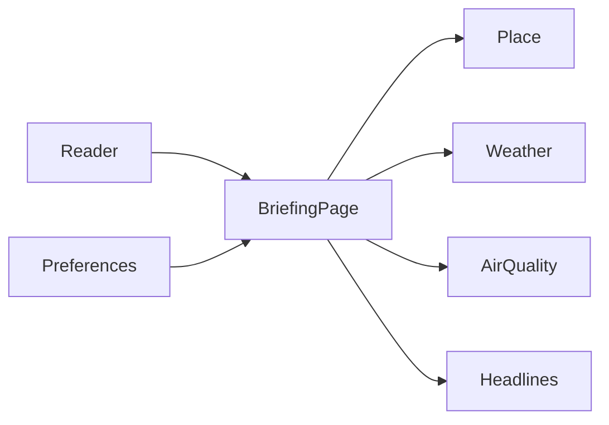

# Daily briefing: architecture

## Conceptual

The reader has one page, a briefing. Four ideas sit behind it: a place, the weather there, the air there, and a short list of headlines. Preferences remember how the reader wants that page set up.

## Logical

`app.py` is the whole application. The sidebar reads and writes preferences. The main column asks for a place, then weather, then air quality when it is enabled, then headlines. Each outside call can fail on its own. A failed city lookup stops the rest of the page. A failed forecast, air-quality call, or feed does not hide the other sections.

| Concern | What it does | How long a result is reused |
| --- | --- | --- |
| Preferences | Load and save city, units, air-quality toggle, and feeds | Until the reader changes them |
| Place | Turn a city name into a location | 30 minutes |
| Weather | Current conditions and five daily rows | 15 minutes |
| Air quality | US AQI, PM2.5, and PM10 | 15 minutes |
| Headlines | Up to five items per selected feed | 15 minutes |

Saved feeds that are no longer in the catalog are dropped. An unrecognized unit falls back to Fahrenheit. A missing or unreadable preferences file falls back to New York, Fahrenheit, air quality on, and BBC News plus NPR News.

## Physical

The app is one Python process, started with `streamlit run app.py` from a local virtual environment (`.venv`). The page is served at `http://localhost:8501`.

| Piece | Where it lives |
| --- | --- |
| Application | `app.py` |
| Dependencies | `requirements.txt`, installed into `.venv` |
| Preferences | `preferences.json` beside `app.py`, unless `DAILY_BRIEFING_PREFS` points somewhere else |
| Tests | `tests/`, run with `.venv/bin/python -m pytest` |
| Place and weather | `geocoding-api.open-meteo.com`, `api.open-meteo.com` |
| Air quality | `air-quality-api.open-meteo.com` |
| Headlines | BBC, NPR, and Ars Technica RSS URLs in `FEEDS` |

Tests mock those HTTP calls. They do not need a network connection or a running Streamlit server.
